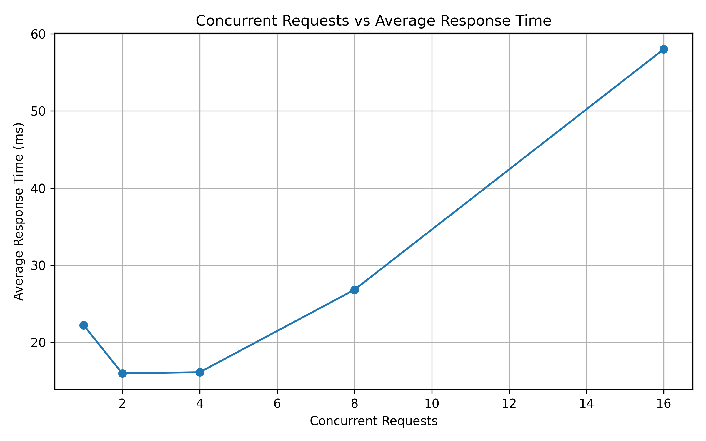
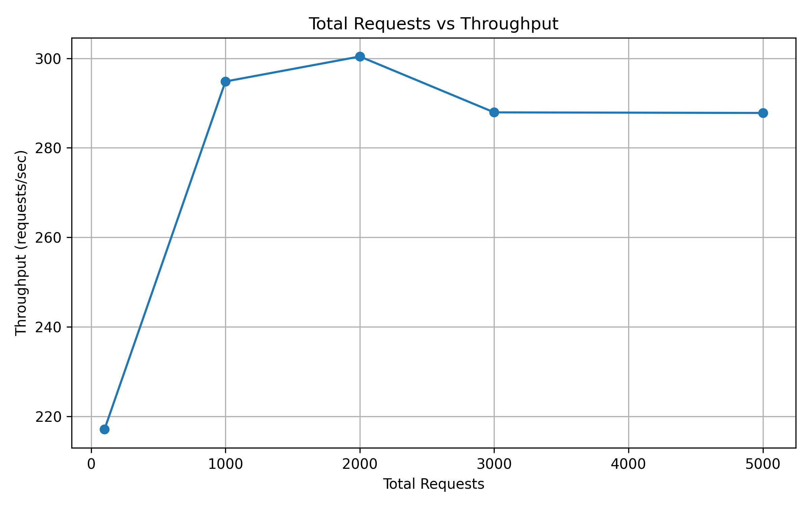
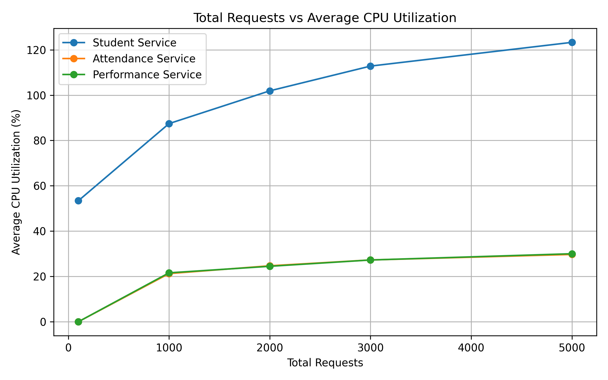
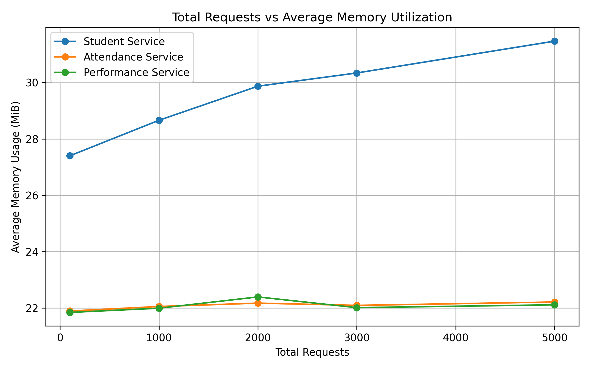

# Student Performance Management - Containerized Microservice Application

**Experiment:** Build, Deploy and Analyze a Containerized Microservice Application Under Varying Workloads  
**Domain:** Student Performance Management  
**Author:** Chirag Salecha

---

## 1. Aim
To develop a microservice-based application with three independent services, containerize and deploy them using Docker and Docker Compose, establish inter-service communication, generate varying workloads, monitor resource utilization, and analyze application performance.

## 2. Technologies Used
- Python 3.x with Flask (REST APIs)
- Gunicorn (production server inside containers)
- Docker and Docker Compose
- Python `requests` and `threading` (load generator)
- `docker stats` (CPU and memory monitoring)
- Matplotlib (graphs)
- PowerShell
- VS Code

## 3. Test Environment
- OS: Windows 11 with PowerShell
- Docker Desktop
- Docker Engine
- Docker Compose
- Python 3.x
- Docker containers connected through a common Docker network

## 4. Architecture

    Client --> student-service (Service 1) --> attendance-service (Service 2)
                                             --> performance-service (Service 3)

All three services run as separate containers on one Docker network. The student-service acts as the entry point and communicates with the attendance-service and performance-service using Docker service names, not localhost.

## 5. Microservices

| Service | Port | Responsibility |
|---|---|---|
| student-service | 5001 | Entry point. Provides student information and generates a combined student summary |
| attendance-service | 5002 | Stores and returns student attendance information |
| performance-service | 5003 | Stores and returns student academic performance information |

### 5.1 student-service (port 5001)
| Endpoint | Description |
|---|---|
| GET /health | Health check |
| GET /students | List all students |
| GET /students/<id> | Get one student |
| GET /student-summary/<id> | Calls attendance-service and performance-service and returns a combined response |

### 5.2 attendance-service (port 5002)
| Endpoint | Description |
|---|---|
| GET /health | Health check |
| GET /attendance/<id> | Get attendance information for a student |

### 5.3 performance-service (port 5003)
| Endpoint | Description |
|---|---|
| GET /health | Health check |
| GET /performance/<id> | Get academic performance information for a student |

### 5.4 Example end-to-end response (GET /student-summary/101)

    {
      "student": {
        "id": 101
      },
      "attendance": {
        "percentage": 85
      },
      "performance": {
        "marks": 88
      }
    }

## 6. Project Structure

    MICROSERVICES/
    |-- student-service/       (app.py, requirements.txt, Dockerfile)
    |-- attendance-service/    (app.py, requirements.txt, Dockerfile)
    |-- performance-service/   (app.py, requirements.txt, Dockerfile)
    |-- docker-compose.yml
    |-- load_test.py
    |-- results/               (results.csv, graphs)
    |-- README.md

---

## 7. Checkpoint 1 - Design and Develop the Microservices

1. Domain selected: Student Performance Management.
2. Three independent microservices identified: student, attendance, performance.
3. Responsibility of each service defined (see section 5).
4. Services implemented in Python using Flask.
5. REST API endpoints created for every service.
6. Each service was run and tested independently.
7. All APIs returned the expected responses.
8. The services were then prepared for Docker deployment.

Test the services locally before containerization:

    cd student-service
    python app.py

The attendance-service and performance-service can be tested in the same way.

## 8. Checkpoint 2 - Containerize and Deploy

1. A separate Dockerfile was created for each service.
2. Each service has its own `requirements.txt`.
3. A Docker image was built for each service.
4. Images were verified with `docker images`.
5. `docker-compose.yml` was created.
6. All three services are configured in Docker Compose.
7. Docker Compose creates a common network for the services.
8. The application is deployed using Docker Compose.
9. All three containers are verified using `docker ps`.

Docker Compose deployment:

    docker compose up --build -d

Verify images:

    docker images

Verify containers:

    docker ps

The services are exposed on:

    student-service      -> 5001
    attendance-service   -> 5002
    performance-service  -> 5003

## 9. Checkpoint 3 - Microservice Communication

1. The Docker network is created through Docker Compose.
2. All three services are connected to the same network.
3. student-service communicates with attendance-service and performance-service.
4. Docker service names are used for inter-service communication.
5. `localhost` is not used for communication between containers.
6. Communication between services was tested successfully.
7. An end-to-end request through all three services was performed.
8. The final combined student response was returned to the client.

Main end-to-end API:

    curl http://localhost:5001/student-summary/101

PowerShell:

    Invoke-RestMethod http://localhost:5001/student-summary/101 | ConvertTo-Json -Depth 5

Check Docker networks:

    docker network ls

Check student-service logs:

    docker compose logs student-service

Check attendance-service logs:

    docker compose logs attendance-service

Check performance-service logs:

    docker compose logs performance-service

## 10. Checkpoint 4 - Workload Generation and Monitoring

1. API selected for testing: `GET /student-summary/101`.
2. The selected API touches all three services.
3. Load generator: custom Python script `load_test.py`.
4. Python `requests` and `threading` are used for generating concurrent requests.
5. Different workload levels are tested.
6. Average response time and throughput are recorded.
7. Successful and failed requests are counted.
8. All three containers are monitored using `docker stats`.
9. CPU and memory utilization are observed for every service.
10. Results are stored for further analysis.

Run the workload test:

    python load_test.py

Monitor the containers in another PowerShell terminal:

    docker stats

Results are stored in the results directory.

## 11. Checkpoint 5 - Results and Analysis

### 11.1 Observation Table

| Workload | Concurrency | Avg Response Time (ms) | Throughput (req/s) | Failed |
|---|---|---|---|---|
| W1 | 1 | Recorded from test | Recorded from test | 0 |
| W2 | 2 | Recorded from test | Recorded from test | 0 |
| W3 | 4 | Recorded from test | Recorded from test | 0 |
| W4 | 8 | Recorded from test | Recorded from test | 0 |
| W5 | 16 | Recorded from test | Recorded from test | 0 |

### 11.2 CPU Utilization (%)

| Workload | Concurrency | student-service | attendance-service | performance-service |
|---|---|---|---|---|
| W1 | 1 | Recorded from test | Recorded from test | Recorded from test |
| W2 | 2 | Recorded from test | Recorded from test | Recorded from test |
| W3 | 4 | Recorded from test | Recorded from test | Recorded from test |
| W4 | 8 | Recorded from test | Recorded from test | Recorded from test |
| W5 | 16 | Recorded from test | Recorded from test | Recorded from test |

### 11.3 Memory Utilization (MB)

| Workload | Concurrency | student-service | attendance-service | performance-service |
|---|---|---|---|---|
| W1 | 1 | Recorded from test | Recorded from test | Recorded from test |
| W2 | 2 | Recorded from test | Recorded from test | Recorded from test |
| W3 | 4 | Recorded from test | Recorded from test | Recorded from test |
| W4 | 8 | Recorded from test | Recorded from test | Recorded from test |
| W5 | 16 | Recorded from test | Recorded from test | Recorded from test |

## 11.4 Graphs

**Concurrent Requests vs Average Response Time**

**Concurrent Requests vs Throughput**

**Concurrent Requests vs CPU Utilization**

**Concurrent Requests vs Memory Utilization**

### 11.5 Analysis

1. **Response time:** As the number of concurrent requests increases, the average response time is expected to increase because more requests compete for the available system resources.
2. **Throughput:** Throughput generally increases as concurrency increases until the application reaches its processing capacity. After saturation, throughput may remain stable or increase only slightly.
3. **Failures:** Successful and failed requests are recorded at every workload level. A stable application should process the tested requests without failures.
4. **Resource usage:** CPU utilization can increase with workload because all three services need to process more incoming requests.
5. **Memory:** Memory utilization is monitored for all three services to determine whether increasing workload causes significant memory growth.
6. **Service dependency:** student-service is the entry point and communicates with attendance-service and performance-service. Therefore, the performance of the end-to-end request depends on all three services.
7. **Bottleneck:** The service showing consistently higher CPU utilization or processing time can be considered a potential bottleneck.
8. **Performance degradation:** Once a service reaches its processing capacity, additional requests may have to wait. This increases response time and can cause throughput to stop increasing.
9. **Scalability:** Since the services are independently containerized, individual services can be scaled according to their workload.

### 11.6 Conclusion

Increasing workload can increase response time while throughput eventually approaches the processing capacity of the application. CPU and memory monitoring helps identify the service that consumes the most resources. The experiment demonstrates how containerized microservices can be monitored and analyzed under varying workloads.

---

## 12. Checkpoint 6 - Docker Resource Monitoring

Docker provides real-time resource statistics using:

    docker stats

The following services were monitored:

    student-service
    attendance-service
    performance-service

The following parameters were observed:

- CPU %
- Memory Usage
- Memory %
- Network Input/Output
- Block Input/Output
- Number of Processes

The collected information was used to understand the resource consumption of each microservice under different workloads.

## 13. Checkpoint 7 - Scalability Analysis

The application was tested with increasing concurrency levels:

    1 -> 2 -> 4 -> 8 -> 16 concurrent requests

The purpose of this experiment was to determine:

1. How response time changes with workload.
2. How throughput changes with workload.
3. How CPU utilization changes.
4. How memory utilization changes.
5. Whether any microservice becomes a bottleneck.
6. Whether the application remains stable under increased workload.

The results can be used to determine the approximate workload at which the current deployment begins to saturate.

## 14. Complete Microservice Request Flow

    Client
      |
      v
    student-service
      |
      +------> attendance-service
      |
      +------> performance-service
      |
      v
    Combined Student Summary
      |
      v
    Client

The student-service acts as the entry point. It receives the request from the client and obtains the required attendance and performance information from the corresponding services.

## 15. Microservice Performance Analysis

### Student Service

student-service is the main entry point of the application.

Responsibilities:

- Accept client requests.
- Provide student information.
- Request attendance information.
- Request performance information.
- Return a combined student summary.

### Attendance Service

attendance-service handles attendance-related information.

Responsibilities:

- Provide health status.
- Return attendance information for a student.
- Process requests independently from the other services.

### Performance Service

performance-service handles academic performance information.

Responsibilities:

- Provide health status.
- Return performance information for a student.
- Process performance requests independently.

## 16. Advantages of the Containerized Architecture

1. Each microservice runs independently.
2. Each service can be developed and tested separately.
3. Each service can be deployed as an individual container.
4. Docker Compose simplifies multi-container deployment.
5. Docker networking enables service-to-service communication.
6. Resource utilization can be monitored independently.
7. Individual services can be scaled according to workload.
8. Service-level isolation is provided.
9. The application is portable across systems supporting Docker.
10. The architecture demonstrates practical microservice deployment.

## 17. Limitations

1. The experiment is performed on a single host machine.
2. Docker Desktop is used as the container runtime environment.
3. The workload is synthetic and may not represent a real production workload.
4. The services use simple application-level data.
5. No external database is required for the basic implementation.
6. Network latency between containers depends on the local Docker environment.
7. Resource measurements can vary depending on background processes on the host machine.
8. The experiment does not represent a multi-node Kubernetes deployment.

## 18. Conclusion

The experiment successfully demonstrates the development and deployment of a containerized microservice application using Docker and Docker Compose.

Three independent services were implemented:

    student-service
    attendance-service
    performance-service

The services were containerized and deployed independently while communicating through a common Docker network.

The end-to-end API:

    GET /student-summary/101

was used to generate workloads and evaluate application performance.

Performance was analyzed using:

- Response time
- Throughput
- CPU utilization
- Memory utilization
- Successful requests
- Failed requests

The experiment demonstrates that a microservice architecture allows individual services to be independently developed, deployed, monitored, and scaled.

Workload testing also helps identify performance bottlenecks and understand how the application behaves as concurrency increases.

---

## 19. How to Run

The project is stored locally at:

    D:\5TH SEM\CC\EVALUATION-1\MICROSERVICES

Open PowerShell and navigate to the project directory:

    cd "D:\5TH SEM\CC\EVALUATION-1\MICROSERVICES"

Build and start all services:

    docker compose up --build -d

Check running containers:

    docker ps

Expected services:

    student-service
    attendance-service
    performance-service

Test student-service:

    curl http://localhost:5001/health

Test attendance-service:

    curl http://localhost:5002/health

Test performance-service:

    curl http://localhost:5003/health

Test the complete application:

    curl http://localhost:5001/student-summary/101

PowerShell alternative:

    Invoke-RestMethod http://localhost:5001/student-summary/101 | ConvertTo-Json -Depth 5

Monitor resource utilization:

    docker stats

Run workload testing:

    python load_test.py

Stop the application:

    docker compose down

## 20. Useful Docker Commands

### View all containers

    docker ps -a

### View Docker images

    docker images

### View Docker networks

    docker network ls

### View all service logs

    docker compose logs

### View student-service logs

    docker compose logs student-service

### View attendance-service logs

    docker compose logs attendance-service

### View performance-service logs

    docker compose logs performance-service

### Follow live logs

    docker compose logs -f

### Restart the application

    docker compose restart

### Stop containers

    docker compose stop

### Remove containers and network

    docker compose down

### Rebuild the application

    docker compose up --build -d

## 21. Final Deliverables Checklist

- [x] Source code of the three microservices
- [x] student-service
- [x] attendance-service
- [x] performance-service
- [x] Three Dockerfiles
- [x] Individual requirements files
- [x] docker-compose.yml
- [x] Docker images
- [x] Running Docker containers
- [x] Docker network
- [x] Inter-service communication
- [x] End-to-end student summary API
- [x] Workload generation script
- [x] CPU monitoring
- [x] Memory monitoring
- [x] Performance results
- [x] Performance graphs
- [x] Workload analysis
- [x] Bottleneck analysis
- [x] Scalability analysis
- [x] Conclusion
- [x] README documentation
